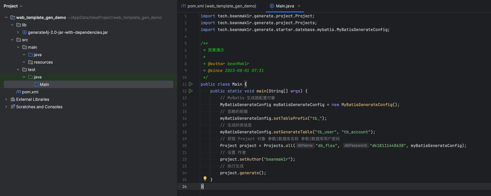

# 简介

快速生成web开发后台代码模版，操作简单，导入依赖后一行代码即可生成所有模版，配合MyBatisX使用效果更佳

生成的内容包括`maven依赖`、`yaml配置`、`基本模板代码`，同时也支持自定义生成器

# 快速开始

第一步：下载lib文件夹中的jar包

第二步：新建一个**maven工程**

第三步：将lib中的jar包导入项目中

第四步：在项目任意地方，编写一个类，用于生成模版代码，参考如下

```java
import cloud.makeronbean.generate.project.Projects;

public class MainTest {
    public static void main(String[] args) {
        // 参数1：数据名称 参数2：数据库密码
        Projects.simple("db_test","123321").generate();
    }
}
```

整体项目结构如下



完成后，运行main方法即可生成代码


# 生成的模板

即可以生成哪些相关代码


## 模板可选项

默认支持生成`Spring boot parent`、`Spring boot Web`、`Spring boot Validation`、`Mybatis-Plus`、`Lombok`、`redisson`、`knife4j`的模版代码。可以通过`Projects`工具类快速构建需要的模板

装配简单模板(`Spring boot + SSM + lombok`)

```java
Project simpleProject = Projects.simple("db_test", "123456");
```

装配所有模板

```java
Project allProject = Projects.all("db_test", "123456");
```

按需装配模版
按照约定大于配置的原则，所有配置均有默认值，可以自行选配

```java
// 自己按需定制模板
Project customerProject = Projects.customer();
// basePackage，默认为 groupId
customerProject.setBasePackage("com.xxx.xxx");

// starter生成工厂，单例模式实现
StarterFactory factory = new StarterFactorySingleImpl();

// Spring Boot Parent依赖，版本为'2.3.6.RELEASE'，已锁死
SpringBootParentStarter parentStarter = factory.getInstance(SpringBootParentStarter.class);
parentStarter
        // 启动类名称，默认为 artifactId + 'Application' 
        .mainBootName("MainApplication")
        // yaml 中的 spring.application.name 配置项，,默认为 artifactId
        .yamlAppName("test-app")
        // 是否导入spring-boot-test-starter，默认导入
        .test(true)
        // 是否导入spring-boot-devtools-starter，默认导入
        .devtools(true);

// web 场景依赖 + validation 场景依赖
SpringBootWebStarter webStarter = factory.getInstance(SpringBootWebStarter.class);
webStarter
        // 是否配置数据校验，默认开启
        .valid(true)
        // 是否导入断言工具类，默认开启
        .asserts(true)
        // 端口号，默认8080
        .serverPort(8080)
        // 是否配置跨域，默认开启
        .cors(true);

// mybatisPlus 场景依赖 + mysql依赖
MyBatisPlusStarter myBatisPlusStarter = factory.getInstance(MyBatisPlusStarter.class);
myBatisPlusStarter
        // 数据库用户名，默认root
        .username("root")
        // 数据库密码，默认'123456'
        .password("123456")
        // 数据库名称，默认为 artifactId
        .dbName("db_test")
        // 数据库端口号，默认为 3306
        .port(3306)
        // 是否开启逻辑删除（isDeleted属性，0未删除，1删除），默认开启
        .logicDelete(true)
        // mysql版本，默认为 '8.0.30'
        .mysqlVersion("8.0.30");

// Lombok 依赖
LombokStarter lombokStarter = factory.getInstance(LombokStarter.class);
lombokStarter
        // lombok版本，默认'1.18.26'
        .version("1.18.26");

// redisTemplate
RedisStarter redisStarter = factory.getInstance(RedisStarter.class)
        // redis 服务器ip，默认本地地址
        .host("localhost")
        // redis端口号，默认 6379
        .port(6379)
        // 密码，默认无
        .password("123456")
        // 哪个数据库，取值0～15，默认0
        .database(1);

// redisson 场景依赖，暂支持单机配置
RedissonStarter redissonStarter = factory.getInstance(RedissonStarter.class);
redissonStarter
        // 哪个数据库，取值0～15，默认0
        .database(0)
        // redisson依赖版本，默认 3.13.6
        .version("3.13.6")
        // redis端口号，默认 6379
        .port(6379)
        // redis 服务器ip，默认本地地址
        .host("127.0.0.1");


// Knife4j 场景依赖
Knife4jStarter knife4jStarter = factory.getInstance(Knife4jStarter.class);
knife4jStarter
        // 标题，默认为 artifactId
        .title("test-title")
        // 描述，默认为其仓库示例代码描述
        .description("test-description")
        // 版本，默认为'2.0.7'
        .version("2.0.7");

// 将starter项添加到project中
customerProject
        .addStarter(parentStarter)
        .addStarter(webStarter)
        .addStarter(myBatisPlusStarter)
        .addStarter(lombokStarter)
			  .addStarter(redisStarter)
        .addStarter(redissonStarter)
        .addStarter(knife4jStarter);
```


## 自定义模板

提供了自定义模板功能，自定义模板只需要继承`StarterAdapter`，按需重写`addCode()`、`addDependency()`、`addYaml()`方法即可

```java
public class CustomerStarter extends StarterAdapter {
    
    @Override
    protected void addDependency(BaseDependency dependency) {
        DependencyItem dependencyItem = new DependencyItem();
      	// 必须配置
        dependencyItem.setGroupId("org.springframework.boot");
        dependencyItem.setArtifactId("spring-boot-starter-web");
        dependencyItem.setTabName(DependencyConst.DEPENDENCY.getTabName());
        dependencyItem.setParentNodeName(DependencyConst.DEPENDENCIES.getTabName());
      
      	// 选配
        dependencyItem.setScope("runtime");
        dependencyItem.setOptional("true");
        dependencyItem.setVersion("2.3.6.RELEASE");
      
      	// 添加到dependency中
        dependency.addDependencyItem(web);

    }
    
    @Override
    protected void addYaml(BaseYaml yaml) {
      	// 添加yaml配置项
        yaml.addYamlConfig("spring.mvc.format.date", "yyyy-MM-dd");
        yaml.addYamlConfig("spring.mvc.format.date-time", "yyyy-MM-dd HH:mm:ss");
        yaml.addYamlConfig("spring.jackson.date-format", "yyyy-MM-dd");
        yaml.addYamlConfig("spring.jackson.time-zone", "Asia/Shanghai");
    }
    
    
    @Override
    protected void addCode(BaseCode code) {
        // 添加代码模板
      	CodeItem cors = new CodeItem();
      	// basePackage下的路径
      	// 例如：完整包名'com.xxx.xxx.config.web'，其中'com.xxx.xxx'为basePackage，只需要添加'config/web'即可
        cors.setPath("config/web");
      	// 类的名字
        cors.setFileName("CORSConfig.java");
      	// 代码模板
        cors.setCodeTemplate(
                "import org.springframework.context.annotation.Configuration;\n" +
                        "import org.springframework.core.Ordered;\n" +
                        "import org.springframework.core.annotation.Order;\n" +
                        "import org.springframework.web.servlet.config.annotation.CorsRegistry;\n" +
                        "import org.springframework.web.servlet.config.annotation.WebMvcConfigurer;\n" +
                        "\n" +
                        "@Configuration\n" +
                        "@Order(Ordered.HIGHEST_PRECEDENCE)\n" +
                        "public class CORSConfig implements WebMvcConfigurer {\n" +
                        "    \n" +
                        "    @Override\n" +
                        "    public void addCorsMappings(CorsRegistry registry) {\n" +
                        "        //允许所有的访问请求（访问路径）\n" +
                        "        registry.addMapping(\"/**\")\n" +
                        "                //允许所有的请求方法访问该跨域资源服务器\n" +
                        "                .allowedMethods(\"*\")\n" +
                        "                //允许所有的请求域名访问我们的跨域资源\n" +
                        "                .allowedOrigins(\"*\")\n" +
                        "                //允许所有的请求header访问\n" +
                        "                .allowedHeaders(\"*\")\n" +
                        "                .allowCredentials(true).maxAge(3600);\n" +
                        "    }\n" +
                        "}"
        );
      	// 添加到代码模板中
        code.addCodeItem(cors);
    }
}
```


# 处理器

处理器用于执行生成模板的逻辑，处理器统一实现了`cloud.makeronbean.generate.handler.GenerateHandler`，默认提供`代码生成处理器`、`yaml生成处理器`、`pom生成处理器`，可以自行删减

下面示例删除了`pom生成处理器`，生成模板时不会添加pom依赖

```java
Project project = Projects.customer();
project.deleteGenerateHandlerByType(PomHandler.class);
```

也可以自定义处理器，并添加到处理器执行列表中

```java
// 自定义一个处理器
GenerateHandler customerHandler = new GenerateHandlerAdapter() {
    /**
     * 代码生成前、starter项加载前执行
     * @throws Exception
     */
    @Override
    public void beforeGenerate() throws Exception {}

    /**
     * 代码执行后执行
     * @throws Exception
     */
    @Override
    public void afterGenerate() throws Exception {}
    /**
     * 代码的生成方法
     * @param starter 当前处理到的starter会被传到这个方法中
     * @throws Exception
     */
    @Override
    public void generateHandler(AbstractStarter starter) throws Exception {}
};
// 将处理器添加到执行列表中
project.addGenerateHandler(customerHandler);
```

